# AIEduPlatform — User Journey & System Flow Guide

> A comprehensive guide for frontend & UI/UX teams describing every user flow in the platform, from first visit to advanced AI-powered study features.

---

## Table of Contents

1. [System Overview](#1-system-overview)
2. [User Roles & Permissions](#2-user-roles--permissions)
3. [Journey Map: Guest → Student → Teacher](#3-journey-map-guest--student--teacher)
4. [Flow 1: Registration & Authentication](#flow-1-registration--authentication)
5. [Flow 2: Student — Course Discovery & Enrollment](#flow-2-student--course-discovery--enrollment)
6. [Flow 3: Student — Learning (Lectures & Materials)](#flow-3-student--learning-lectures--materials)
7. [Flow 4: Student — AI Study Session](#flow-4-student--ai-study-session)
8. [Flow 5: Student — Taking Exams](#flow-5-student--taking-exams)
9. [Flow 6: Student — Viewing Grades & Progress](#flow-6-student--viewing-grades--progress)
10. [Flow 7: Student — Course Reviews](#flow-7-student--course-reviews)
11. [Flow 8: Becoming a Teacher](#flow-8-becoming-a-teacher)
12. [Flow 9: Teacher — Course Creation & Management](#flow-9-teacher--course-creation--management)
13. [Flow 10: Teacher — Lecture & Material Management](#flow-10-teacher--lecture--material-management)
14. [Flow 11: Teacher — Exam & Question Management](#flow-11-teacher--exam--question-management)
15. [Flow 12: Teacher — Grading Workflow](#flow-12-teacher--grading-workflow)
16. [Flow 13: Teacher — Dashboard & Analytics](#flow-13-teacher--dashboard--analytics)
17. [Flow 14: Teacher — Student Engagement Monitoring](#flow-14-teacher--student-engagement-monitoring)
18. [Flow 15: AI Provider Management](#flow-15-ai-provider-management)
19. [Complete State Machine Diagram](#complete-state-machine-diagram)
20. [Token Lifecycle & Session Management](#token-lifecycle--session-management)
21. [Frontend Integration Notes](#frontend-integration-notes)

---

## 1. System Overview

AIEduPlatform is an AI-powered educational platform where:

- **Students** browse courses, enroll, access lecture materials, use AI study tools (chat, flashcards, mind maps, quizzes, summaries), take exams, and track their progress.
- **Teachers** create courses with lectures and materials, create and manage exams (with AI question generation), grade submissions (manually or with AI assistance), and monitor student performance.
- **AI Features** are integrated throughout: question generation, essay grading, study chat (RAG-powered), flashcard generation, mind map creation, quiz generation, topic summarization, and dialogue audio generation (TTS).
- **Real-time Notifications** via SignalR for course events, grading updates, and engagement alerts.
- **AI Providers** are switchable at runtime between Ollama (local) and Groq (cloud).

### Architecture at a Glance

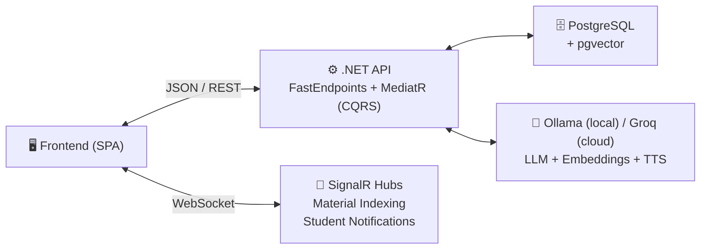

---

## 2. User Roles & Permissions

| Capability                        | Guest | Student | Teacher |
| --------------------------------- | :---: | :-----: | :-----: |
| Browse published courses          |  ✅   |   ✅    |   ✅    |
| Search courses                    |  ✅   |   ✅    |   ✅    |
| View course details               |  ✅   |   ✅    |   ✅    |
| View course reviews & ratings     |  ✅   |   ✅    |   ✅    |
| Register / Login                  |  ✅   |   —     |   —     |
| Enroll in courses                 |  ❌   |   ✅    |   ✅    |
| Access lecture content            |  ❌   |   ✅    |   ✅    |
| Stream/download materials         |  ❌   |   ✅    |   ✅    |
| AI Study Sessions (chat, quiz...) |  ❌   |   ✅    |   ✅    |
| Dialogue Audio (TTS)              |  ❌   |   ✅    |   ✅    |
| Take exams                        |  ❌   |   ✅    |   ✅    |
| Submit reviews                    |  ❌   |   ✅    |   ❌    |
| Complete courses                  |  ❌   |   ✅    |   ✅    |
| View own grades & stats           |  ❌   |   ✅    |   ✅    |
| Switch AI provider                |  ❌   |   ✅    |   ✅    |
| Receive real-time notifications   |  ❌   |   ✅    |   ✅    |
| Create & manage courses           |  ❌   |   ❌    |   ✅    |
| Upload materials                  |  ❌   |   ❌    |   ✅    |
| Create & manage exams             |  ❌   |   ❌    |   ✅    |
| AI question generation            |  ❌   |   ❌    |   ✅    |
| Grade submissions (manual & AI)   |  ❌   |   ❌    |   ✅    |
| Student engagement monitoring     |  ❌   |   ❌    |   ✅    |
| Send engagement alerts            |  ❌   |   ❌    |   ✅    |
| Teacher dashboard                 |  ❌   |   ❌    |   ✅    |

> **Note:** A user can hold both `Student` and `Teacher` roles simultaneously.

---

## 3. Journey Map: Guest → Student → Teacher

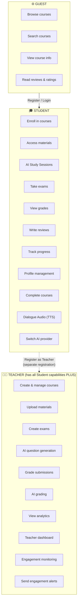

---

## Flow 1: Registration & Authentication

### 1.1 New User Registration

Two separate registration endpoints exist — one for **students** and one for **teachers**.

#### Student Registration

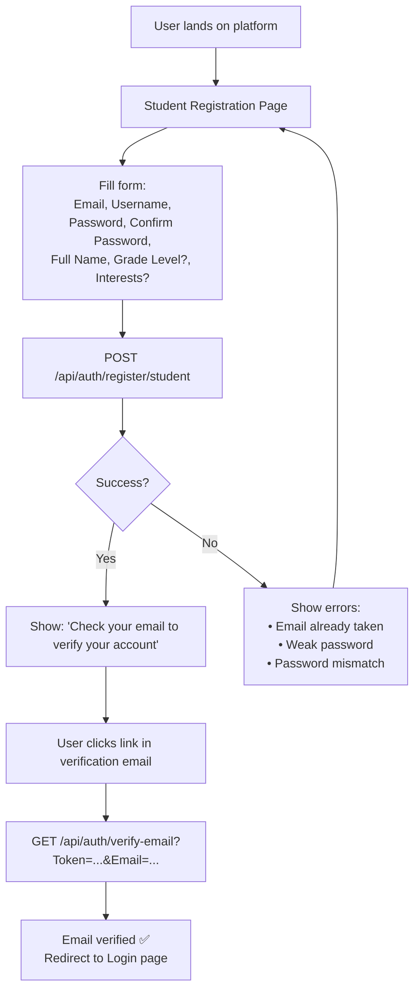

**API Call:** `POST /api/auth/register/student`

#### Teacher Registration

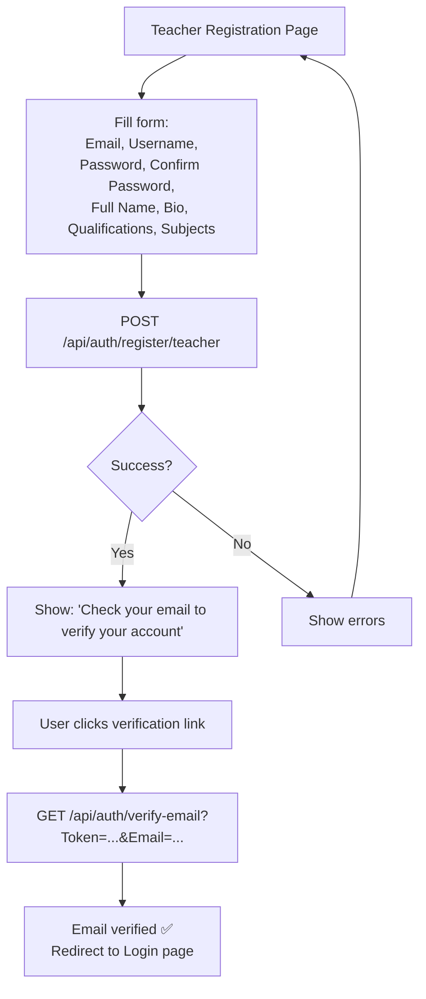

**API Call:** `POST /api/auth/register/teacher`

> **Note:** There is no "Become Teacher" endpoint. Users choose their role at registration time. The registration page should offer a toggle or separate forms for Student vs Teacher.

**UI States:**
- **Idle** — Form displayed with all fields
- **Loading** — Submit button disabled, spinner shown
- **Success** — Success message directing user to check email
- **Verified** — After clicking email link, redirect to login
- **Error** — Inline field errors (email taken, password mismatch, etc.)

**Validation Rules (client-side):**
- Email: Valid email format
- Username: Not empty, no special characters
- Password: Minimum length, complexity requirements
- Confirm Password: Must match Password
- Full Name: Required
- Bio, Qualifications, Subjects: Required for teacher registration

---

### 1.2 Login

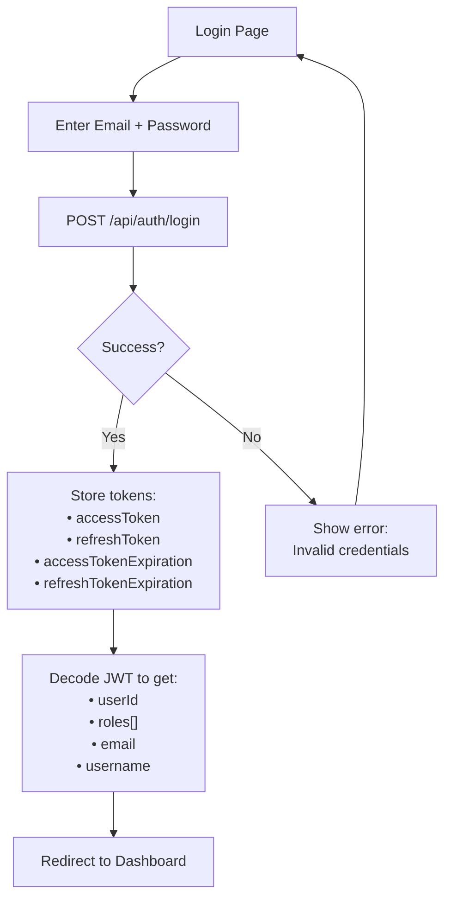

**API Call:** `POST /api/auth/login`

**Post-Login State:**
After successful login, the frontend should:
1. Store `accessToken` and `refreshToken` securely (e.g., httpOnly cookie or secure storage)
2. Decode the JWT to extract user info and roles
3. Set up an auth interceptor that adds `Authorization: Bearer <token>` to all API calls
4. Set up a token refresh mechanism (see [Token Lifecycle](#token-lifecycle--session-management))
5. Redirect based on role:
   - **Student only** → Student Dashboard / Course Catalog
   - **Teacher (with or without Student)** → Teacher Dashboard (with option to switch to Student view)

---

### 1.3 Logout

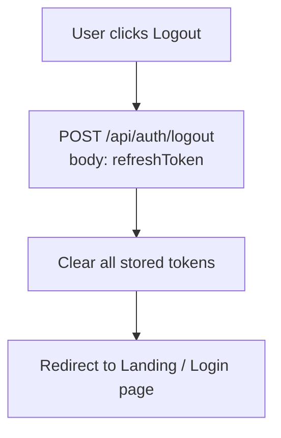

---

### 1.4 Token Refresh Flow

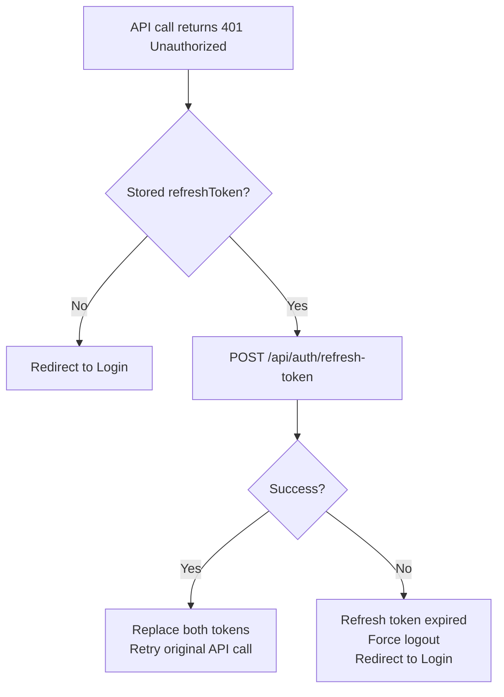

---

## Flow 2: Student — Course Discovery & Enrollment

### 2.1 Browsing Courses

```
Student navigates to Course Catalog
       │
       ▼
GET /api/courses?Page=1&PageSize=12
```

**Suggested Course Catalog UI Layout:**

```
┌──────────────────────────────────────────────────────────────┐
│                     COURSE CATALOG                           │
│                                                              │
│  ┌─[ Search Bar ]──────────────────────────────────────┐    │
│  │  🔍  "Search courses..."                             │    │
│  └──────────────────────────────────────────────────────┘    │
│                                                              │
│  ┌──────────────┐  ┌──────────────┐  ┌──────────────┐      │
│  │  Course Card  │  │  Course Card  │  │  Course Card  │      │
│  │              │  │              │  │              │      │
│  │  📚 Title    │  │  📚 Title    │  │  📚 Title    │      │
│  │  By: Teacher │  │  By: Teacher │  │  By: Teacher │      │
│  │  ⭐ 4.5 (23)│  │  ⭐ 3.8 (15)│  │  ⭐ 5.0 (8) │      │
│  │  📖 12 lect. │  │  📖 8 lect.  │  │  📖 5 lect.  │      │
│  │  👥 45 enr.  │  │  👥 23 enr.  │  │  👥 12 enr.  │      │
│  │              │  │              │  │              │      │
│  │  [Enrolled ✓]│  │  [Enroll]    │  │  [Enroll]    │      │
│  └──────────────┘  └──────────────┘  └──────────────┘      │
│                                                              │
│  ◄  Page 1 of 3  ►                                         │
└──────────────────────────────────────────────────────────────┘
```

> **Note:** UI wireframes above are layout suggestions. Adapt to your design system.

**Data displayed per card** (from `CourseListDto`):
- `title` — Course name
- `teacherName` — Instructor name
- `averageRating` + `reviewCount` — Star rating
- `lectureCount` — Number of lectures
- `enrollmentCount` — Number of enrolled students
- `isEnrolled` — Whether the current user is enrolled (controls button state)

**Search:**
- User types in search bar → `GET /api/courses/search?Keyword=...&Page=1&PageSize=12`
- Debounce search input (300ms recommended)

---

### 2.2 Viewing Course Details

**Suggested Course Detail Page UI Layout:**

```
┌──────────────────────────────────────────────────────────────┐
│                    COURSE DETAIL PAGE                        │
│                                                              │
│  Title: "Introduction to Machine Learning"                   │
│  Instructor: Dr. Smith                                       │
│  ⭐ 4.5 / 5  (23 reviews)                                  │
│  👥 45 students enrolled                                    │
│                                                              │
│  Description:                                                │
│  Learn the fundamentals of machine learning, from            │
│  linear regression to deep neural networks...                │
│                                                              │
│  ┌──────────────────────────────────────────────────────┐   │
│  │  Course Outline                                       │   │
│  │  1. What is Machine Learning?                         │   │
│  │  2. Supervised Learning                               │   │
│  │  3. Neural Networks Basics                            │   │
│  │  4. Deep Learning                                     │   │
│  │  5. ...                                               │   │
│  └──────────────────────────────────────────────────────┘   │
│                                                              │
│  ┌────────────────────┐   ┌─────────────────────────────┐   │
│  │  [Enroll Now]       │   │  Reviews Section            │   │
│  │  or                 │   │  (GET /courses/{id}/reviews)│   │
│  │  [Already Enrolled] │   │  + Rating summary           │   │
│  └────────────────────┘   │  (GET /courses/{id}/rating) │   │
│                            └─────────────────────────────┘   │
└──────────────────────────────────────────────────────────────┘
```

**API Calls:**
1. `GET /api/courses/{CourseId}` — Course details + lecture titles
2. `GET /api/courses/{CourseId}/reviews?Page=1` — Reviews list
3. `GET /api/courses/{CourseId}/rating` — Rating summary with distribution

**Enrollment Button States:**
- **Not logged in:** "Login to Enroll" → redirects to login
- **Logged in, not enrolled:** "Enroll Now" → `POST /api/courses/{CourseId}/enroll`
- **Already enrolled:** "Go to Course" → navigates to course learning page
- **Is instructor:** "Manage Course" → navigates to course management

---

### 2.3 Enrolling in a Course

Courses are enrolled via a **Cart → Checkout → Payment** flow for paid courses, or directly for free courses.

#### Free Course — Direct Enrollment
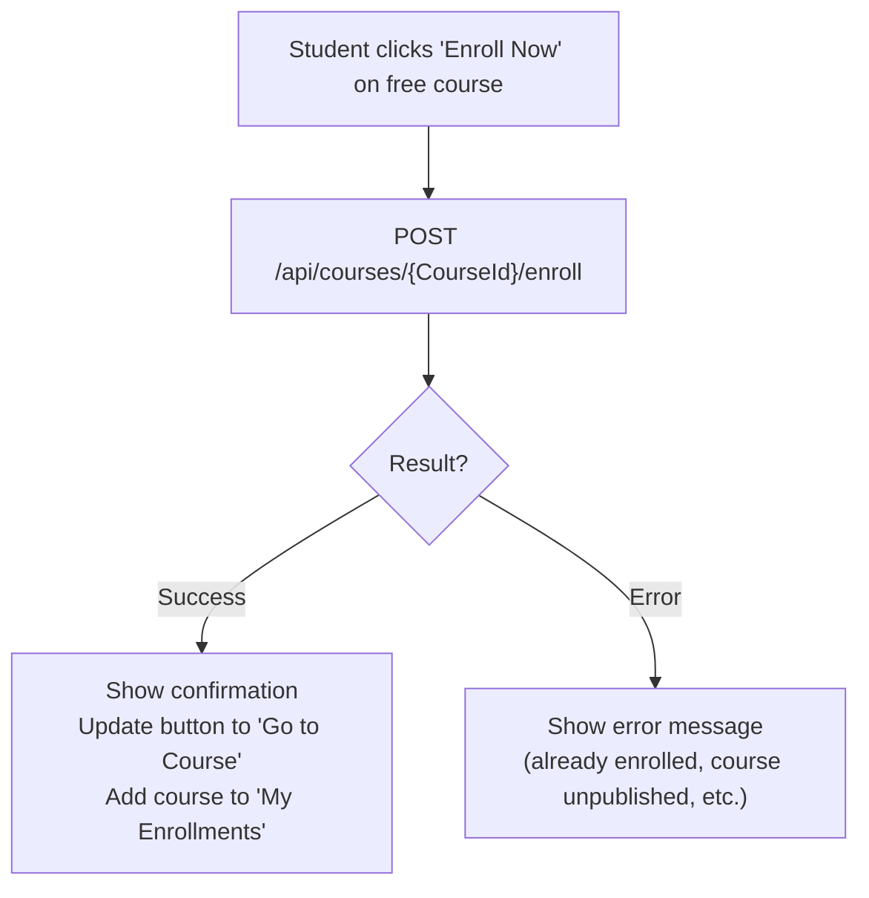

#### Paid Course — Cart & Checkout
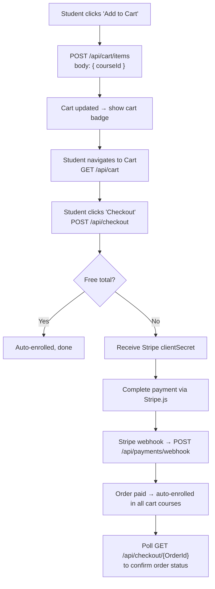

---

### 2.4 Managing Enrollments

**Suggested My Enrollments UI Layout:**

```
┌──────────────────────────────────────────────────────────────┐
│                    MY ENROLLED COURSES                        │
│                                                              │
│  ┌─────────────────────────────────────────────────────┐    │
│  │  📚 Introduction to ML          Status: Active       │    │
│  │  Enrolled: Jan 20, 2026         [Continue Learning]  │    │
│  │                                 [Unenroll]           │    │
│  └─────────────────────────────────────────────────────┘    │
│  ┌─────────────────────────────────────────────────────┐    │
│  │  📚 Data Structures              Status: Active       │    │
│  │  Enrolled: Feb 1, 2026          [Continue Learning]  │    │
│  └─────────────────────────────────────────────────────┘    │
└──────────────────────────────────────────────────────────────┘
```

**API:** `GET /api/courses/enrolled?Page=1&PageSize=10`

**Unenroll:** `DELETE /api/courses/{CourseId}/unenroll` — Show confirmation dialog first.

---

### 2.5 Completing a Course

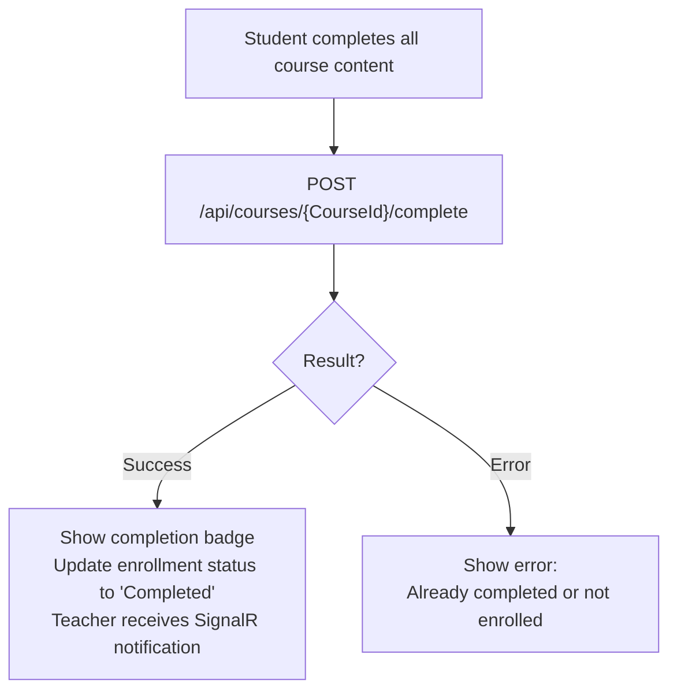

**UI Display:** Show a "Complete Course" button on the course page once the student feels they've finished. After completion, show a completion badge and update the enrollment status.

---

## Flow 3: Student — Learning (Lectures & Materials)

### 3.1 Accessing Course Content

**Suggested Course Learning Page UI Layout:**

```
┌──────────────────────────────────────────────────────────────┐
│                    COURSE LEARNING PAGE                       │
│                                                              │
│  ┌─── Sidebar ───────┐  ┌─── Main Content ──────────────┐  │
│  │                    │  │                                │  │
│  │  Course Lectures   │  │  Lecture: Neural Networks      │  │
│  │                    │  │                                │  │
│  │  1. What is ML?    │  │  Description: Understanding    │  │
│  │  2. Supervised ✓   │  │  the basics of neural          │  │
│  │  ▶ 3. Neural Nets  │  │  networks...                   │  │
│  │  4. Deep Learning  │  │                                │  │
│  │  5. CNNs           │  │  ┌── Materials ─────────────┐ │  │
│  │                    │  │  │  📄 Lecture Notes.pdf      │ │  │
│  │                    │  │  │  🎥 Lecture Recording.mp4  │ │  │
│  │  ──────────────    │  │  │  🔊 Podcast Episode.mp3   │ │  │
│  │  Quick Actions:    │  │  │  🖼️ Diagram.png           │ │  │
│  │  🤖 AI Study      │  │  └───────────────────────────┘ │  │
│  │  📝 Take Exam     │  │                                │  │
│  │  📊 My Progress   │  └────────────────────────────────┘  │
│  └────────────────────┘                                      │
└──────────────────────────────────────────────────────────────┘
```

**API Calls:**
1. `GET /api/courses/{CourseId}/lectures?IncludeMaterials=true` — All lectures with materials
2. **On lecture click:** `GET /api/lectures/{LectureId}` — Detailed lecture with materials grouped by type

---

### 3.2 Viewing/Streaming Materials

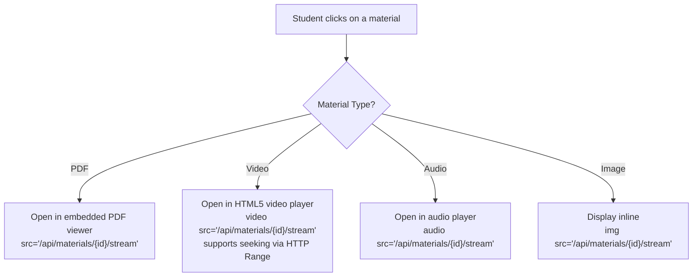

**Stream URL:** Each material has a `streamUrl` field (e.g., `/api/materials/{id}/stream`). Use this as the `src` for media elements.

**Authentication for Media:** Since `<video>` and `<audio>` tags can't set Authorization headers:
- **Option A:** Use a service worker to intercept requests and add the auth header
- **Option B:** Use `fetch()` with auth header, convert to blob URL
- **Option C:** Add a short-lived token as query parameter (requires backend support)

---

## Flow 4: Student — AI Study Session

### 4.1 Starting a Study Session

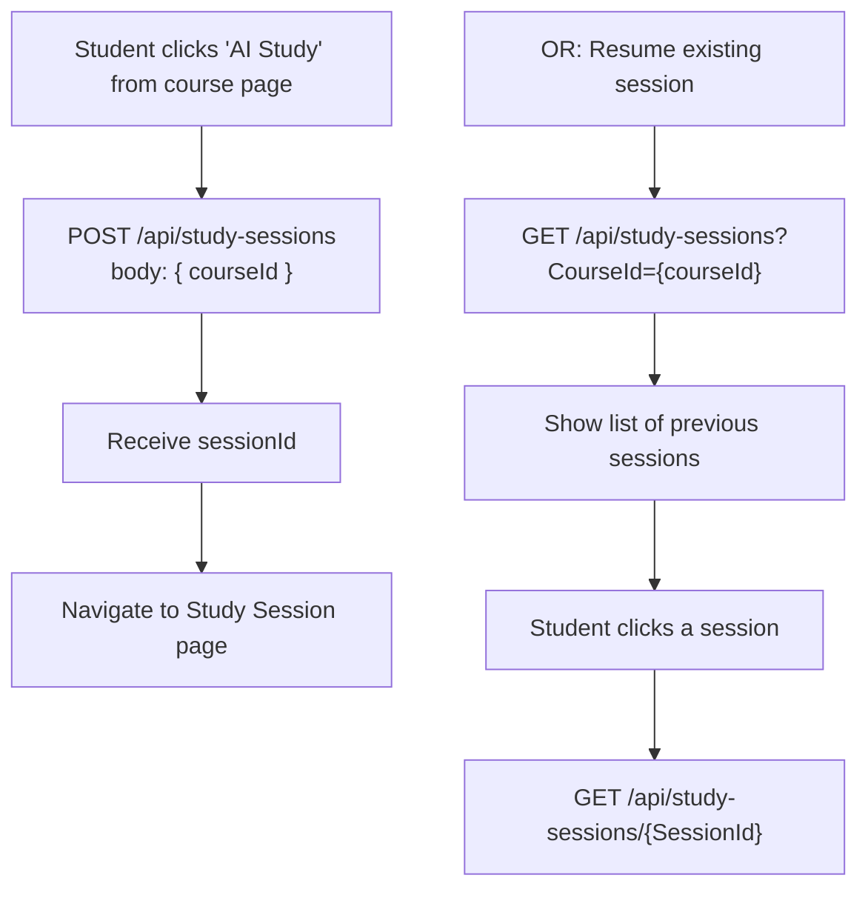

---

### 4.2 Study Session Interface

**Suggested Study Session UI Layout:**

```
┌──────────────────────────────────────────────────────────────┐
│                    AI STUDY SESSION                           │
│  Course: Introduction to ML                                  │
│  Session started: Feb 14, 2026 10:00 AM                     │
│                                                              │
│  ┌── Tool Tabs ──────────────────────────────────────────┐  │
│  │  [💬 Chat]  [📇 Flashcards]  [🧠 Mind Map]           │  │
│  │  [📝 Quiz]  [📋 Summary]                              │  │
│  └────────────────────────────────────────────────────────┘  │
│                                                              │
│  ┌── Chat Area (default tab) ────────────────────────────┐  │
│  │                                                        │  │
│  │  🤖 AI: Hello! I'm your AI study assistant for ...     │  │
│  │  👤 You: Explain backpropagation in simple terms       │  │
│  │  🤖 AI: Backpropagation is an algorithm used to ...    │  │
│  │        [streaming in real-time]                         │  │
│  │  Sources: Lecture 3 - Neural Networks.pdf (Page 12)    │  │
│  │                                                        │  │
│  └────────────────────────────────────────────────────────┘  │
│                                                              │
│  ┌── Scope Filter (Optional) ────────────────────────────┐  │
│  │  📖 Lectures: [☐ Select lectures to focus on...]       │  │
│  │  📎 Materials: [Select specific materials...]          │  │
│  └────────────────────────────────────────────────────────┘  │
│                                                              │
│  [End Session]                                               │  │
│                                                              │
│  ┌── Message Input ──────────────────────────────────────┐  │
│  │  Type your question...                         [Send]  │  │
│  └────────────────────────────────────────────────────────┘  │
└──────────────────────────────────────────────────────────────┘
```

---

### 4.3 AI Chat Flow (Streaming)

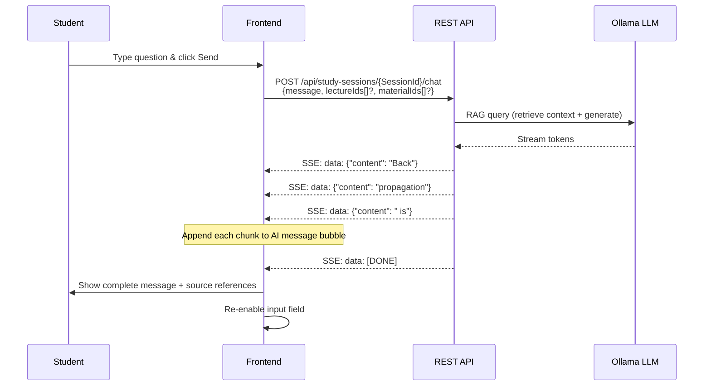

**UI States during streaming:**
1. **Sending** — Input disabled, show typing indicator
2. **Streaming** — AI message bubble grows as chunks arrive
3. **Complete** — Input re-enabled, sources shown below message

**Loading previous chat:** `GET /api/study-sessions/{SessionId}/chat`

---

### 4.4 Flashcard Generation Flow

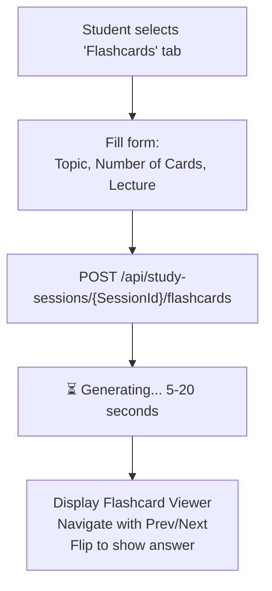

**Suggested Flashcard Viewer UI Layout:**

```
┌──────────────────────────────────────┐
│  Flashcard Viewer                    │
│  Card 3 of 15                        │
│                                      │
│  ┌──────────────────────────────┐   │
│  │  FRONT:                      │   │
│  │  What is a Convolutional     │   │
│  │  Neural Network (CNN)?       │   │
│  │        [Flip Card 🔄]        │   │
│  └──────────────────────────────┘   │
│                                      │
│  [◄ Prev]        [Next ►]           │
│  Progress: ███████░░░░░░░ 3/15      │
└──────────────────────────────────────┘
```

**Previously generated flashcards:** `GET /api/study-sessions/{SessionId}/flashcards`

---

### 4.5 Mind Map Generation Flow

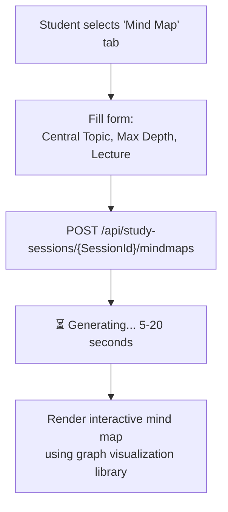

**Data structure:** `nodes` is a recursive JSON tree. `connections` is an array of edges. Use a graph visualization library (D3.js, vis.js, React Flow) to render.

**Previously generated mind maps:** `GET /api/study-sessions/{SessionId}/mindmaps`

---

### 4.6 Practice Quiz Flow

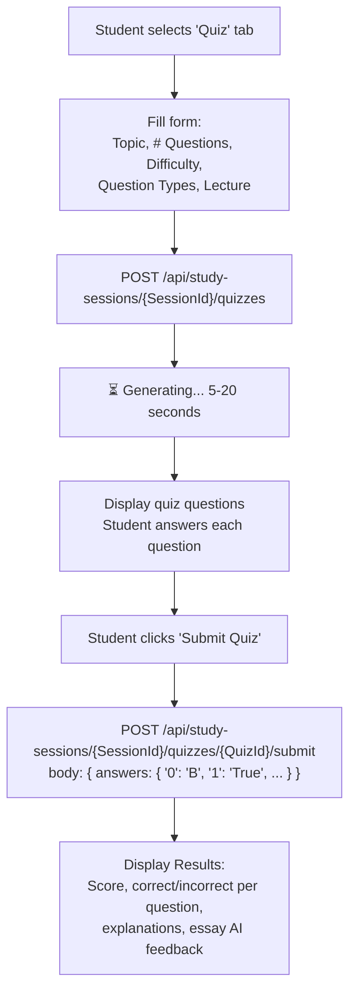

**Suggested Practice Quiz UI Layout:**

```
┌──────────────────────────────────────┐
│  Practice Quiz                        │
│  Topic: Neural Networks | Medium      │
│                                      │
│  Question 3 of 10                    │
│                                      │
│  Which activation function is most   │
│  commonly used in hidden layers?     │
│                                      │
│  ○ A) Sigmoid                        │
│  ● B) ReLU                           │
│  ○ C) Tanh                           │
│  ○ D) Softmax                        │
│                                      │
│  [◄ Prev]  [Next ►]  [Submit Quiz]  │
│  Progress: ███████░░░░░░░ 3/10      │
└──────────────────────────────────────┘
```

**Suggested Quiz Results UI Layout:**

```
┌──────────────────────────────────────┐
│  Quiz Results                         │
│  Score: 80% (8/10 correct)           │
│                                      │
│  Q1: ✅ Correct                      │
│  Your answer: B) ReLU                │
│  Explanation: ReLU is preferred...   │
│                                      │
│  Q2: ❌ Incorrect                    │
│  Your answer: True                   │
│  Correct: False                      │
│  Explanation: Actually...            │
│                                      │
│  Q7: 📝 Essay (AI-graded)           │
│  Score: 7.5/10                       │
│  Feedback: Good understanding but... │
│                                      │
│  [Try Again]  [New Quiz]             │
└──────────────────────────────────────┘
```

**Previously generated quizzes:** `GET /api/study-sessions/{SessionId}/quizzes`

---

### 4.7 Summary Generation Flow

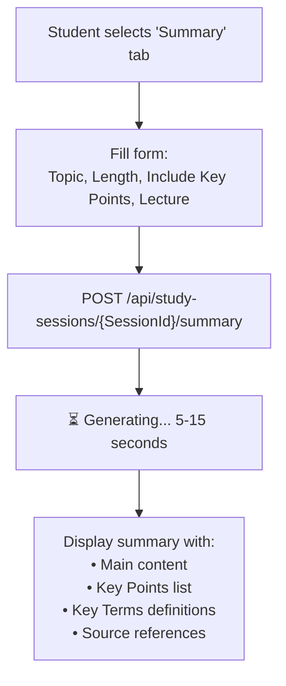

---

### 4.8 Dialogue Audio Generation

AI generates a teacher-student dialogue about a topic, then synthesizes it as audio using text-to-speech.

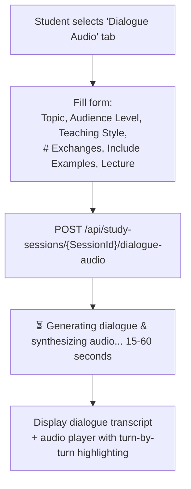

**Suggested Dialogue Audio Player UI:**

```
┌──────────────────────────────────────┐
│  🎵 Dialogue Audio Player            │
│  Topic: Backpropagation              │
│                                      │
│  ▶ ████████████░░░░ 2:25 / 4:10     │
│                                      │
│  ┌────────────────────────────────┐  │
│  │ 👨‍🏫 Teacher: (highlighted)     │  │
│  │ "Let's talk about how neural  │  │
│  │  networks actually learn..."   │  │
│  │                                │  │
│  │ 🎓 Student:                    │  │
│  │ "So how does it know which    │  │
│  │  direction to adjust..."       │  │
│  │                                │  │
│  │ 👨‍🏫 Teacher:                    │  │
│  │ "Great question! That's where │  │
│  │  gradient descent comes in..." │  │
│  └────────────────────────────────┘  │
│                                      │
│  [Download Audio]  [Regenerate]      │
└──────────────────────────────────────┘
```

**Frontend Implementation:**
- Decode `audioBase64` → create Blob URL → use as `<audio>` source
- Use `turnTimestamps` array to highlight the active speaker/text as audio plays
- Each turn has `startTime`, `endTime`, `speaker`, and `text`
- Show teaching style options: Socratic, Explanatory, Interactive
- Show audience level options: Beginner, Intermediate, Advanced

**Voice Configuration:** Use `GET /api/dialogue/voice-config/default` to get available voices. Use `GET /api/dialogue/voice-previews` to let students preview voices before generating.

---

### 4.9 Ending a Study Session

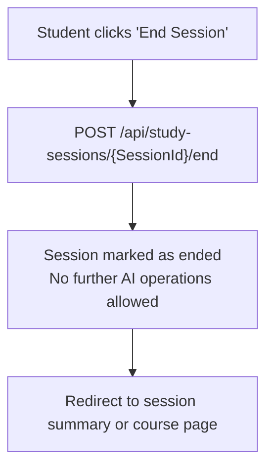

---

### 4.10 Study Session Stats

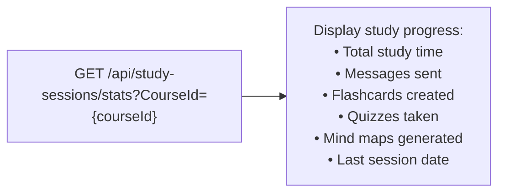

---

## Flow 5: Student — Taking Exams

### 5.1 Discovering Available Exams

**Suggested Available Exams UI Layout:**

```
┌──────────────────────────────────────────────────────────────┐
│                    AVAILABLE EXAMS                             │
│                                                              │
│  ┌─────────────────────────────────────────────────────┐    │
│  │  📝 Midterm Exam - Machine Learning                  │    │
│  │  Course: Introduction to ML                          │    │
│  │  Duration: 90 min | 20 questions                     │    │
│  │  Window: Mar 1, 9:00 AM — Mar 1, 12:00 PM           │    │
│  │  Status: 🟢 Active Now                               │    │
│  │                                        [Start Exam]  │    │
│  └─────────────────────────────────────────────────────┘    │
│  ┌─────────────────────────────────────────────────────┐    │
│  │  📝 Quiz 2 - Data Structures                        │    │
│  │  Course: Data Structures & Algorithms                │    │
│  │  Duration: 45 min | 15 questions                     │    │
│  │  Window: Mar 5, 2:00 PM — Mar 5, 4:00 PM            │    │
│  │  Status: 🟡 Upcoming (starts in 3 days)              │    │
│  │                                        [View Details] │    │
│  └─────────────────────────────────────────────────────┘    │
└──────────────────────────────────────────────────────────────┘
```

**API:** `GET /api/exams/available?Page=1&PageSize=10`

**Additional exam endpoints for students:**
- `GET /api/exams/active/{CourseId}` — Currently active exams
- `GET /api/exams/upcoming/{CourseId}` — Future exams
- `GET /api/exams/past/{CourseId}` — Completed exams
- `GET /api/exams/course/{CourseId}` — All exams for a course

---

### 5.2 Taking an Exam

**Suggested Exam Taking UI Layout:**

```
┌──────────────────────────────────────────────────────────────┐
│              EXAM: Midterm - Machine Learning                 │
│  ⏱️ Time Remaining: 01:28:35        Total: 100 points       │
│                                                              │
│  Question 1 of 20 (5 pts)                    [MultipleChoice]│
│  ─────────────────────────────────────────                   │
│  Which of the following is a supervised learning algorithm?   │
│  ○ A) K-Means Clustering                                    │
│  ● B) Support Vector Machine                                │
│  ○ C) Principal Component Analysis                          │
│  ○ D) DBSCAN                                                │
│                                                              │
│  Question 2 of 20 (2 pts)                       [TrueFalse] │
│  ─────────────────────────────────────────                   │
│  Gradient descent always finds the global minimum.           │
│  ○ True    ● False                                           │
│                                                              │
│  Question 15 of 20 (20 pts)                         [Essay] │
│  ─────────────────────────────────────────                   │
│  Explain the concept of backpropagation and its role in      │
│  training neural networks.                                   │
│  ┌──────────────────────────────────────────────────────┐   │
│  │  [Text area for essay response]                       │   │
│  └──────────────────────────────────────────────────────┘   │
│                                                              │
│  Question Navigator:                                         │
│  [1●] [2●] [3○] [4○] [5●] ... [20○]                        │
│  ● = Answered  ○ = Unanswered                               │
│                                                              │
│  [Submit Exam]                                               │
└──────────────────────────────────────────────────────────────┘
```

**API Calls:**
- `GET /api/exams/{ExamId}` — Exam with questions
- `GET /api/exams/{ExamId}/total-points` — Total points

---

### 5.3 Exam Submission

```mermaid
flowchart TD
    A["Student clicks 'Submit Exam'"] --> B["Confirmation dialog:<br/>'You've answered 18/20 questions.<br/>2 questions are unanswered.'"]
    B -->|Confirmed| C["POST /api/exams/{ExamId}/submit<br/>body: { answers: { guid1: 'B', guid2: 'False', ... } }"]
    C --> D["Show confirmation:<br/>'Exam submitted! Submission ID: {id}<br/>You'll be notified when grades are available.'"]
    B -->|Cancel| E["Return to exam"]
```

**Important Frontend Behaviors:**
- Start a countdown timer based on `durationMinutes`
- Auto-save answers locally (localStorage) in case of disconnect
- Highlight answered vs unanswered questions in the navigator
- Show warning when time is running low (5 min, 1 min)
- Auto-submit when timer expires
- Hide `correctAnswer` from the question data during exam — only show after submission is graded

---

## Flow 6: Student — Viewing Grades & Progress

### 6.1 Viewing Submissions & Grades

**Suggested My Submissions UI Layout:**

```
┌──────────────────────────────────────────────────────────────┐
│                    MY SUBMISSIONS                             │
│                                                              │
│  ┌─────────────────────────────────────────────────────┐    │
│  │  📝 Midterm - Machine Learning                       │    │
│  │  Submitted: Mar 1, 2026 10:30 AM                     │    │
│  │  Status: ✅ Graded          Score: 85/100 (85%)      │    │
│  │                               [View Details]          │    │
│  └─────────────────────────────────────────────────────┘    │
│  ┌─────────────────────────────────────────────────────┐    │
│  │  📝 Quiz 1 - Data Structures                        │    │
│  │  Submitted: Feb 28, 2026 3:15 PM                     │    │
│  │  Status: ⏳ Pending Grade                            │    │
│  │                               [View Details]          │    │
│  └─────────────────────────────────────────────────────┘    │
└──────────────────────────────────────────────────────────────┘
```

**API:** `GET /api/exams/submissions/student?Page=1&PageSize=10`

**View submission details:** `GET /api/exams/submissions/{SubmissionId}`
→ Shows: answers, grade (if graded), feedback, per-question breakdown

**View grade:** `GET /api/exams/submissions/{SubmissionId}/grade`

---

### 6.2 Student Grade Statistics

**Suggested Grade Stats UI Layout:**

```
┌──────────────────────────────────────┐
│  My Academic Performance              │
│                                      │
│  Exams Taken: 8                      │
│  Average Score: 82.5%                │
│  Highest: 98%  |  Lowest: 65%       │
│  Points: 660 / 800 (82.5%)          │
│                                      │
│  📊 [Score trend chart]              │
└──────────────────────────────────────┘
```

**API:** `GET /api/grades/stats/student/{StudentId}`

### 6.3 My Grades List

`GET /api/exams/grades/student?Page=1` — Shows all grades with score, feedback, AI-graded indicator, and approval status.

---

### 6.4 Overall User Stats

**Suggested Learning Dashboard UI Layout:**

```
┌──────────────────────────────────────┐
│  My Learning Dashboard                │
│                                      │
│  📚 5 courses enrolled               │
│  ✅ 2 courses completed              │
│  📝 8 exams taken (avg: 82.5%)      │
│  🤖 15 AI study sessions            │
│  📇 45 flashcards created           │
│  🧪 12 practice quizzes             │
│  ⏱️ 5h 30m total study time         │
│  📅 Last active: Feb 14, 2026       │
└──────────────────────────────────────┘
```

**API:** `GET /api/users/stats`

---

## Flow 7: Student — Course Reviews

### 7.1 Writing a Review

```mermaid
flowchart TD
    A["Student on course detail page<br/>(must be enrolled)"] --> B{"hasReviewed === false?"}
    B -->|Yes| C["Show 'Write a Review' form<br/>Rating: 1-5 stars<br/>Comment: optional text"]
    C --> D["POST /api/courses/{CourseId}/reviews<br/>body: { rating: 5, comment: '...' }"]
    D --> E{Result?}
    E -->|201 Created| F["Show success<br/>Refresh reviews list"]
    E -->|409 Conflict| G["'You've already reviewed this course'"]
    B -->|No| H["Show existing review<br/>with Edit/Delete options"]
```

### 7.2 Editing/Deleting a Review

- **Edit:** `PUT /api/reviews/{ReviewId}` (only by review author)
- **Delete:** `DELETE /api/reviews/{ReviewId}` (by author or course instructor)

---

## Flow 8: Teacher Registration

Users who want to teach must register a separate teacher account via `POST /api/auth/register/teacher`, or register as a teacher from the start.

```mermaid
flowchart TD
    A["User wants to teach"] --> B["Navigate to Teacher Registration"]
    B --> C["Fill form: Email, Username,<br/>Password, Full Name,<br/>Bio, Qualifications, Subjects"]
    C --> D["POST /api/auth/register/teacher"]
    D --> E["Verify email → Login"]
    E --> F["JWT contains Teacher role<br/>Teacher features visible in UI"]
```

> **Note:** There is no runtime "Become Teacher" endpoint. The Teacher role is assigned at registration.

---

## Flow 9: Teacher — Course Creation & Management

### 9.1 Creating a New Course

```mermaid
flowchart TD
    A["Teacher clicks 'Create Course'"] --> B["Fill form: Title + Description"]
    B --> C["POST /api/courses<br/>body: { title, description }"]
    C --> D["201 Created → { courseId }"]
    D --> E["Redirect to Course Management page<br/>(Course is UNPUBLISHED — invisible to students)"]
```

---

### 9.2 Course Management Page

**Suggested Course Management UI Layout:**

```
┌──────────────────────────────────────────────────────────────┐
│              MANAGE COURSE: Introduction to ML               │
│  Status: 🔴 Unpublished                                     │
│                                                              │
│  ┌── Actions ────────────────────────────────────────────┐  │
│  │  [Edit Details] [Publish Course] [Delete Course]       │  │
│  └────────────────────────────────────────────────────────┘  │
│                                                              │
│  ┌── Lectures ───────────────────────────────────────────┐  │
│  │  1. What is Machine Learning?          [Edit] [Delete] │  │
│  │     📎 3 materials                                     │  │
│  │  2. Supervised Learning                [Edit] [Delete] │  │
│  │     📎 2 materials                                     │  │
│  │  [+ Add Lecture]                                       │  │
│  └────────────────────────────────────────────────────────┘  │
│                                                              │
│  ┌── Exams ──────────────────────────────────────────────┐  │
│  │  📝 Midterm Exam       20 questions    [Manage] [Delete]│  │
│  │  📝 Final Exam         0 questions     [Manage] [Delete]│  │
│  │  [+ Create Exam]                                       │  │
│  └────────────────────────────────────────────────────────┘  │
│                                                              │
│  ┌── Students ───────────────────────────────────────────┐  │
│  │  45 students enrolled     [View All Students]          │  │
│  │  API: GET /api/courses/{CourseId}/enrollments           │  │
│  └────────────────────────────────────────────────────────┘  │
└──────────────────────────────────────────────────────────────┘
```

---

### 9.3 Publishing a Course

```mermaid
flowchart TD
    A["Teacher clicks 'Publish Course'"] --> B["Confirmation dialog:<br/>'Publishing will make this course<br/>visible to all students.'"]
    B -->|Confirmed| C["POST /api/courses/{CourseId}/publish"]
    C --> D["Update status: 🟢 Published"]
    B -->|Cancel| E["Return to management page"]
```

---

### 9.4 My Courses View

`GET /api/courses/my-courses?IncludeUnpublished=true` — Shows all courses (published + drafts) with management actions.

---

## Flow 10: Teacher — Lecture & Material Management

### 10.1 Adding a Lecture

```mermaid
flowchart TD
    A["Teacher clicks '+ Add Lecture'"] --> B["Fill form: Title, Description, Order"]
    B --> C["POST /api/courses/{CourseId}/lectures<br/>body: { title, description, orderIndex: 3 }"]
    C --> D["201 Created → Refresh lecture list"]
```

---

### 10.2 Uploading Materials

```mermaid
flowchart TD
    A["Teacher navigates to lecture → 'Upload Materials'"] --> B["Select files via drag & drop or browse<br/>Supported: PDF, MP4, MP3, PNG, JPG..."]
    B --> C["Optionally set custom titles"]
    C --> D["POST multipart/form-data<br/>/api/courses/lectures/{LectureId}/materials<br/>Files + ?Titles=..."]
    D --> E["Show upload progress bar"]
    E --> F["201 Created → { materialIds }"]
    F --> G["Materials appear with 'Indexing...' badge"]
    G --> H["Background AI processing:<br/>text extraction, embedding, RAG indexing"]
    H --> I["Badge changes to 'Indexed ✅'"]
```

**Important Notes for Frontend:**
- Show upload progress bar for large files
- Material type is auto-detected from file extension — no need to ask the user
- After upload, materials initially have `indexed: false` — poll or use a notification system to update the UI when indexing completes
- The `streamUrl` field on each material provides the access URL

---

### 10.3 Managing Materials

**API:** `GET /api/courses/lectures/{LectureId}/materials`

Each material shows:
- Title, Type icon (📄 📹 🔊 🖼️), Indexed status, Stream/preview link
- **Delete:** `DELETE /api/courses/materials/{MaterialId}`

---

## Flow 11: Teacher — Exam & Question Management

### 11.1 Creating an Exam

```mermaid
flowchart TD
    A["Teacher clicks '+ Create Exam'"] --> B["Fill form:<br/>Title, Start Time, End Time, Duration"]
    B --> C["POST /api/courses/{CourseId}/exams"]
    C --> D["201 Created → Navigate to Exam Question Editor"]
```

---

### 11.2 Adding Questions

Teachers can add questions in three ways:

```mermaid
flowchart TD
    A["Add Questions to Exam"] --> B{Method?}
    B -->|"Manual (one at a time)"| C["POST /api/exams/{ExamId}/questions<br/>body: { type, text, options, correctAnswer, points }"]
    B -->|"Bulk (multiple)"| D["POST /api/exams/{ExamId}/questions/bulk<br/>body: { questions: [{...}, {...}] }"]
    B -->|"AI Generation"| E["Configure:<br/>• # Questions, Difficulty<br/>• Question Types (MCQ, T/F, Essay)<br/>• Focus Topics<br/>• Source Lectures"]
    E --> F["POST /api/exams/{ExamId}/questions/generate-ai"]
    F --> G["⏳ Generating... 15-30 seconds"]
    G --> H["Questions added to exam<br/>Teacher can review & edit each"]
```

**Suggested AI Question Generator UI Layout:**

```
┌──────────────────────────────────────────────────────────────┐
│              AI QUESTION GENERATOR                            │
│                                                              │
│  Number of Questions: [10              ]                     │
│  Difficulty: [Medium ▼]                                     │
│  Question Types:                                             │
│  ☑ Multiple Choice  ☑ True/False                            │
│  ☐ Short Answer     ☐ Essay                                 │
│                                                              │
│  Focus Topics (optional):                                    │
│  [Neural Networks, Backpropagation    ]                      │
│                                                              │
│  Source Material:                                            │
│  ☑ Lecture 3: Neural Networks                                │
│  ☑ Lecture 4: Deep Learning                                  │
│  ☐ Lecture 5: CNNs                                           │
│                                                              │
│  [Generate Questions 🤖]                                    │
│  ⏳ Generating... This may take 15-30 seconds               │
└──────────────────────────────────────────────────────────────┘
```

---

### 11.3 Question Management Interface

**Suggested Question Management UI Layout:**

```
┌──────────────────────────────────────────────────────────────┐
│              EXAM QUESTIONS: Midterm Exam                     │
│  Total: 20 questions | 100 points                            │
│                                                              │
│  ┌─ Q1 ─────────────────────────────────────────────────┐   │
│  │  [MultipleChoice] 5 pts                  [Edit][Del] │   │
│  │  Which algorithm is used for classification?          │   │
│  │  A) K-Means  B) SVM ✓  C) PCA  D) DBSCAN            │   │
│  └──────────────────────────────────────────────────────┘   │
│                                                              │
│  ┌─ Q2 ─────────────────────────────────────────────────┐   │
│  │  [TrueFalse] 2 pts                      [Edit][Del] │   │
│  │  The Earth revolves around the Sun.   Answer: True ✓  │   │
│  └──────────────────────────────────────────────────────┘   │
│                                                              │
│  ┌─ Q3 ─────────────────────────────────────────────────┐   │
│  │  [Essay] 20 pts                          [Edit][Del] │   │
│  │  Explain backpropagation...                           │   │
│  │  Model Answer: "Backpropagation is..."                │   │
│  └──────────────────────────────────────────────────────┘   │
│                                                              │
│  [+ Add Question]  [+ Bulk Add]  [🤖 AI Generate]          │
│  [Reorder Questions]                                         │
└──────────────────────────────────────────────────────────────┘
```

**Reorder:** `POST /api/exams/{ExamId}/questions/reorder` — Drag-and-drop interface.

---

## Flow 12: Teacher — Grading Workflow

### 12.1 Grading Overview

**Suggested Grading Dashboard UI Layout:**

```
┌──────────────────────────────────────────────────────────────┐
│              GRADING DASHBOARD                               │
│                                                              │
│  ┌── Ungraded Submissions (14) ──────────────────────────┐  │
│  │  📝 Midterm - John Doe          Mar 1  [Grade] [AI ▶] │  │
│  │  📝 Midterm - Jane Smith         Mar 1  [Grade] [AI ▶] │  │
│  │  📝 Quiz 1 - Bob Wilson          Feb 28 [Grade] [AI ▶] │  │
│  └────────────────────────────────────────────────────────┘  │
│                                                              │
│  ┌── Pending AI Approvals (5) ───────────────────────────┐  │
│  │  📝 Midterm - Alice Brown   AI: 82%  [Review][Approve]│  │
│  │  📝 Midterm - Charlie Lee   AI: 75%  [Review][Approve]│  │
│  └────────────────────────────────────────────────────────┘  │
└──────────────────────────────────────────────────────────────┘
```

**API Calls:**
- `GET /api/exams/submissions/ungraded` — All ungraded across all exams
- `GET /api/exams/grades/pending-approval` — AI grades needing approval

---

### 12.2 Manual Grading

```mermaid
flowchart TD
    A["Teacher clicks 'Grade' on a submission"] --> B["GET /api/exams/submissions/{SubmissionId}<br/>Load student answers + questions"]
    B --> C["Review each answer:<br/>• MCQ/TF: auto-checked ✅/❌<br/>• Essay: read student response + model answer"]
    C --> D["Enter overall score + feedback"]
    D --> E["POST /api/exams/submissions/{SubmissionId}/grade<br/>body: { score: 85.0, feedback: '...' }"]
    E --> F["Grade saved → Move to next submission"]
```

---

### 12.3 AI Grading

```mermaid
flowchart TD
    A["Teacher clicks 'AI ▶' on a submission"] --> B["POST /api/exams/submissions/{SubmissionId}/grade-ai"]
    B --> C["⏳ AI is grading... 10-30 seconds"]
    C --> D["AI returns grade with:<br/>• Score per question<br/>• Essay feedback & confidence<br/>• Overall score"]
    D --> E["Status: ⚠️ Pending Teacher Approval"]
    E --> F{Teacher decision?}
    F -->|"Approve as-is"| G["POST /api/exams/grades/{GradeId}/approve"]
    F -->|"Modify & Approve"| H["PUT /api/exams/grades/{GradeId}<br/>(edit score/feedback) → then approve"]
    F -->|"Reject & Re-grade"| I["Grade manually instead"]
```

---

### 12.4 Viewing Exam Grades & Stats

**Suggested Exam Grades UI Layout:**

```
┌──────────────────────────────────────────────────────────────┐
│              EXAM GRADES: Midterm Exam                        │
│                                                              │
│  ┌── Statistics ─────────────────────────────────────────┐  │
│  │  Graded: 28/30  |  Pending: 2                         │  │
│  │  Average: 76.4%  |  Median: 78%  |  Pass Rate: 85.7% │  │
│  │  Highest: 98%    |  Lowest: 35%                        │  │
│  └────────────────────────────────────────────────────────┘  │
│                                                              │
│  ┌── Distribution ───────────────────────────────────────┐  │
│  │  A (90-100): ████████ 8                               │  │
│  │  B (80-89):  ████████████ 12                          │  │
│  │  C (70-79):  ██████ 6                                 │  │
│  │  D (60-69):  ███ 3                                    │  │
│  │  F (0-59):   █ 1                                      │  │
│  └────────────────────────────────────────────────────────┘  │
│                                                              │
│  ┌── Grade List ─────────────────────────────────────────┐  │
│  │  Student         Score    AI?    Approved   Feedback   │  │
│  │  John Doe        85%      ❌     —          "Good..."  │  │
│  │  Jane Smith      92%      ✅     ✅         "Excell." │  │
│  │  Bob Wilson      75%      ✅     ⚠️         "Review"  │  │
│  └────────────────────────────────────────────────────────┘  │
└──────────────────────────────────────────────────────────────┘
```

**API Calls:**
- `GET /api/exams/{ExamId}/grades` — All grades list
- `GET /api/grades/stats/exam/{ExamId}` — Stats (avg, median, pass rate)
- `GET /api/grades/distribution/{ExamId}` — A/B/C/D/F distribution

---

## Flow 13: Teacher — Dashboard & Analytics

### 13.1 Teacher Dashboard

**Suggested Teacher Dashboard UI Layout:**

```
┌──────────────────────────────────────────────────────────────┐
│              TEACHER DASHBOARD                               │
│                                                              │
│  ┌────────┐  ┌────────┐  ┌────────┐  ┌────────┐           │
│  │   3    │  │   2    │  │   87   │  │   12   │           │
│  │ Total  │  │ Publi- │  │Students│  │ Exams  │           │
│  │Courses │  │ shed   │  │Enrolled│  │Created │           │
│  └────────┘  └────────┘  └────────┘  └────────┘           │
│                                                              │
│  ┌── Action Required ────────────────────────────────────┐  │
│  │  ⚠️ 5 AI grades pending your approval [Review Now →]  │  │
│  │  📝 14 ungraded submissions            [Grade Now →]   │  │
│  └────────────────────────────────────────────────────────┘  │
│                                                              │
│  ┌── My Courses (GET /api/courses/my-courses) ───────────┐  │
│  │  📚 Intro to ML          🟢 Published  45 students    │  │
│  │  📚 Advanced DL          🟢 Published  23 students    │  │
│  │  📚 NLP Fundamentals     🔴 Draft      0 students     │  │
│  └────────────────────────────────────────────────────────┘  │
└──────────────────────────────────────────────────────────────┘
```

**API:** `GET /api/users/teacher/dashboard`

---

## Flow 14: Teacher — Student Engagement Monitoring

### 14.1 Viewing Engagement Report

Teachers can monitor per-student engagement metrics to identify at-risk students.

```mermaid
flowchart TD
    A["Teacher navigates to course → 'Engagement' tab"] --> B["GET /api/courses/{CourseId}/engagement"]
    B --> C["Display engagement report with<br/>per-student metrics sorted by risk level"]
```

**Suggested Engagement Dashboard UI Layout:**

```
┌──────────────────────────────────────────────────────────────┐
│              STUDENT ENGAGEMENT: Introduction to ML          │
│                                                              │
│  ┌── Summary ────────────────────────────────────────────┐  │
│  │  Total Enrolled: 45  |  Active: 38  |  At Risk: 7     │  │
│  │  Average Engagement Score: 65.2%                       │  │
│  └────────────────────────────────────────────────────────┘  │
│                                                              │
│  [Send Alert to All At-Risk Students]                        │
│                                                              │
│  ┌── Student List (sorted by engagement, lowest first) ──┐  │
│  │  ⚠️ John Doe         Score: 15%   🔴 Critical         │  │
│  │     Sessions: 1  |  Last active: 25 days ago           │  │
│  │     Exams: 0/3   |  Chat messages: 2                  │  │
│  │                                          [Send Alert]  │  │
│  │                                                        │  │
│  │  ⚠️ Jane Smith       Score: 35%   🟠 Low              │  │
│  │     Sessions: 3  |  Last active: 15 days ago           │  │
│  │     Exams: 1/3   |  Avg Score: 72%                    │  │
│  │                                          [Send Alert]  │  │
│  │                                                        │  │
│  │  ✅ Bob Wilson        Score: 85%   🟢 High             │  │
│  │     Sessions: 12 |  Last active: 1 day ago             │  │
│  │     Exams: 3/3   |  Avg Score: 92%                    │  │
│  └────────────────────────────────────────────────────────┘  │
└──────────────────────────────────────────────────────────────┘
```

**Engagement Level Colors:**
- 🔴 `Critical` (0–25) — Immediate attention needed
- 🟠 `Low` (26–50) — At risk
- 🟡 `Moderate` (51–75) — Adequate
- 🟢 `High` (76–100) — Actively engaged

---

### 14.2 Sending Engagement Alerts

```mermaid
flowchart TD
    A["Teacher clicks 'Send Alert'"] --> B{Target?}
    B -->|"Individual student"| C["POST /api/courses/{CourseId}/engagement/alerts<br/>body: { studentIds: [guid], customMessage: '...' }"]
    B -->|"All at-risk students"| D["POST /api/courses/{CourseId}/engagement/alerts<br/>body: { studentIds: null, customMessage: '...' }"]
    C --> E["Alert sent via SignalR<br/>to targeted students"]
    D --> E
    E --> F["Show confirmation:<br/>'5 alerts sent to: John, Jane, ...'"]
```

**Frontend Notes:**
- Students receive alerts via the `StudentNotificationHub` SignalR connection as `EngagementAlert` events
- If no `studentIds` are specified, the API automatically targets all `Critical` and `Low` engagement students
- Teachers can include a custom message encouraging students to catch up

---

## Flow 15: AI Provider Management

Teachers and students can switch the active LLM provider at runtime.

### 15.1 Checking Provider Status

```mermaid
flowchart TD
    A["User navigates to Settings → AI Provider"] --> B["GET /api/ai/provider"]
    B --> C["Display current provider and options"]
```

**Suggested AI Provider Settings UI:**

```
┌──────────────────────────────────────┐
│  AI Provider Settings                 │
│                                      │
│  Current Provider: 🟢 Ollama (Local) │
│                                      │
│  Available Providers:                │
│  ● Ollama (Local) — Default          │
│    Free, runs locally                │
│  ○ Groq (Cloud)                      │
│    Requires API key                  │
│    Status: ❌ Not configured          │
│                                      │
│  [Switch Provider]                   │
└──────────────────────────────────────┘
```

### 15.2 Switching Providers

```mermaid
flowchart TD
    A["User selects a different provider"] --> B["POST /api/ai/provider/switch<br/>body: { provider: 'groq' }"]
    B --> C{Success?}
    C -->|Yes| D["Update UI: 'Switched from ollama to groq'"]
    C -->|Error| E["Show error: 'API key not configured'"]
```

> **Note:** Provider switching affects all AI features: chat, flashcards, quizzes, mind maps, summaries, dialogue audio, and AI grading.

---

## Complete State Machine Diagram

### User State Machine

```mermaid
stateDiagram-v2
    [*] --> Guest
    Guest --> Student : Register + Login
    Student --> Guest : Logout
    Student --> StudentTeacher : Register as Teacher
    StudentTeacher --> Guest : Logout

    state Guest {
        [*] --> Browsing
        Browsing : Browse courses
        Browsing : Search courses
        Browsing : View details & reviews
    }

    state Student {
        [*] --> Learning
        Learning : Enroll in courses
        Learning : Access materials
        Learning : AI Study Sessions
        Learning : Take exams
        Learning : View grades
        Learning : Write reviews
    }

    state StudentTeacher {
        [*] --> Teaching
        Teaching : All Student capabilities
        Teaching : Create & manage courses
        Teaching : Upload materials
        Teaching : Create exams & AI questions
        Teaching : Grade submissions
        Teaching : Teacher dashboard
    }
```

### Course Lifecycle

```mermaid
stateDiagram-v2
    [*] --> Draft : Course Created
    Draft --> Published : POST /publish
    Published --> Published : Students enroll
    Draft --> [*] : DELETE course
    Published --> [*] : DELETE course (cascade)

    state Draft {
        [*] --> Editing
        Editing : Add lectures
        Editing : Upload materials
        Editing : Create exams
    }

    state Published {
        [*] --> Active
        Active : Visible to students
        Active : Enrollments open
        Active : Materials accessible
    }
```

### Exam Lifecycle

```mermaid
stateDiagram-v2
    [*] --> ExamDraft : Exam Created (0 questions)
    ExamDraft --> ExamReady : Questions added
    ExamReady --> ExamActive : Time window opens
    ExamActive --> ExamEnded : Time window closes

    state ExamActive {
        [*] --> AcceptingSubmissions
        AcceptingSubmissions : Students can submit
    }

    state ExamEnded {
        [*] --> GradingPhase
        GradingPhase : No more submissions
    }
```

### Submission & Grading Lifecycle

```mermaid
stateDiagram-v2
    [*] --> Answering : Student starts exam
    Answering --> Submitted : POST /submit
    Submitted --> Graded : Grade assigned

    state Graded {
        [*] --> GradeType
        GradeType --> ManualGrade : Teacher grades manually
        GradeType --> AIGrade : AI grades
        AIGrade --> PendingApproval : Awaiting teacher review
        PendingApproval --> Approved : Teacher approves
        ManualGrade --> Final
        Approved --> Final
    }
```

---

## Token Lifecycle & Session Management

### Token Flow Diagram

```mermaid
flowchart TD
    A["POST /api/auth/login"] --> B["Receive Access Token (short-lived ~30 min)<br/>Receive Refresh Token (long-lived ~30 days)"]
    B --> C["Store tokens securely"]
    C --> D["Make API Call"]
    D --> E{Access token expired?}
    E -->|No| F["Use it normally"]
    E -->|Yes| G["POST /api/auth/refresh-token"]
    G --> H{Success?}
    H -->|Yes| I["Replace both tokens<br/>Retry original call"]
    I --> D
    H -->|No| J["Redirect to Login"]

    K["Special Cases"] --> L["Teacher role assigned at registration"]
    K --> M["Logout → Call logout API + clear local tokens"]
    K --> N["Multiple tabs → Use shared storage for token sync"]
```

### Recommended Token Storage Strategy

| Storage Method        | Access Token | Refresh Token | Security Level |
| --------------------- | :----------: | :-----------: | :------------: |
| httpOnly Cookie       | ✅ Best      | ✅ Best       | Highest        |
| Secure localStorage   | ⚠️ OK        | ⚠️ OK        | Medium         |
| In-memory (variable)  | ✅ Best      | ❌ Lost on refresh | Highest (short-lived) |

**Recommended:** Store access token in memory, refresh token in httpOnly cookie. This prevents XSS attacks from accessing tokens while maintaining session persistence.

---

## Frontend Integration Notes

### 1. API Request Interceptor Setup

```mermaid
flowchart TD
    A["Outgoing API Request"] --> B["Add 'Authorization: Bearer {accessToken}' header"]
    B --> C{Access token expired?}
    C -->|No| D["Send request normally"]
    C -->|Yes| E["Call refresh-token endpoint"]
    E --> F{Refresh success?}
    F -->|Yes| G["Update stored tokens<br/>Retry original request with new token"]
    F -->|No| H["Redirect to login"]
```

### 2. Role-Based UI Rendering

```mermaid
flowchart TD
    A["Decode JWT → Extract roles[]"] --> B{roles includes 'Teacher'?}
    B -->|Yes| C["Show: Dashboard, Create Course,<br/>Grade, Analytics"]
    B -->|No| D["Hide teacher-only features"]
    A --> E{roles includes 'Student'?}
    E -->|Yes| F["Show: Enroll, Study Sessions,<br/>Submit Exam, Review"]
    E -->|No| G["(shouldn't happen — all users are students)"]
```

### 3. Loading States for AI Operations

AI features can take 10-60 seconds. Always show appropriate loading UI:

| Operation            | Expected Duration | UI Recommendation                        |
| -------------------- | :---------------: | ---------------------------------------- |
| AI Chat Message      | 2-15 sec          | Streaming text (real-time)               |
| Generate Flashcards  | 5-20 sec          | Skeleton cards + spinner                 |
| Generate Mind Map    | 5-20 sec          | Loading animation                        |
| Generate Quiz        | 5-20 sec          | Skeleton questions                       |
| Generate Summary     | 5-15 sec          | Loading animation with progress text     |
| Dialogue Audio       | 15-60 sec         | Progress bar + "Generating dialogue & synthesizing audio" |
| AI Question Gen      | 15-60 sec         | Progress bar + "This may take a moment"  |
| AI Grading           | 10-30 sec         | Loading spinner + status text            |
| Material Upload      | 1-60 sec          | Upload progress bar                      |

### 4. Real-time/Polling Features

| Feature                  | Mechanism        | Notes                                    |
| ------------------------ | ---------------- | ---------------------------------------- |
| AI Chat                  | SSE Streaming    | Use ReadableStream API                   |
| Material indexing status | SignalR / Polling | `ReceiveIndexingNotification` event or poll every 10s |
| Course events            | SignalR           | `NewExamPosted`, `NewLectureAdded`, `NewMaterialUploaded`, etc. |
| Grade notifications      | SignalR           | `SubmissionGraded`, `GradeApproved`, `GradeUpdated` |
| Engagement alerts        | SignalR           | `EngagementAlert` sent to at-risk students |
| Teacher activity         | SignalR           | `ExamSubmitted`, `NewEnrollment`, `NewReview`, etc. |
| Exam timer               | Client-side      | Start on exam load, auto-submit on expiry |

### 5. Error Handling Summary

```mermaid
flowchart TD
    A["API Error Response"] --> B{Status Code?}
    B -->|400| C["Show validation errors inline"]
    B -->|401| D["Attempt token refresh → Login if fails"]
    B -->|403| E["Show 'Permission Denied' message"]
    B -->|404| F["Show 'Resource Not Found' page"]
    B -->|409| G["Show specific message<br/>e.g. 'Already reviewed'"]
    B -->|500| H["Show generic error + retry button"]
```

### 6. Pagination Pattern

All paginated endpoints follow the same pattern:

```
?Page=1&PageSize=10
```

Frontend pagination component should:
1. Track current page in URL query params (for deep linking)
2. Show page numbers with prev/next based on `hasPrevious`/`hasNext`
3. Show total count and current range (e.g., "Showing 1-10 of 47")
4. Default to `PageSize=10` (or 12 for card grids)

### 7. SSE (Server-Sent Events) for Chat

The chat endpoint uses SSE for streaming AI responses. Implementation guide:

```mermaid
sequenceDiagram
    participant FE as Frontend
    participant API as Backend API

    FE->>API: POST /api/study-sessions/{id}/chat<br/>{message body}
    Note over FE: Read response as stream (not JSON)
    API-->>FE: data: {"content": "chunk1"}
    API-->>FE: data: {"content": "chunk2"}
    Note over FE: Append each chunk to AI message bubble
    API-->>FE: data: [DONE]
    Note over FE: Mark message complete<br/>Re-enable input
```

### 8. File Upload Best Practices

- Use `FormData` API for multipart uploads
- Show file previews before upload
- Validate file types client-side (match supported extensions)
- Show per-file and overall upload progress
- Handle large files (up to 500MB for videos) with chunked reading
- Show clear error messages for unsupported file types

---

> **Document Version:** 2.0
> **Last Updated:** February 25, 2026
> **API Version:** v1
> **For questions or clarifications, contact the backend development team.**
